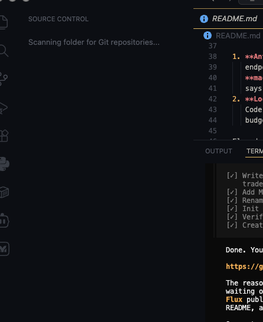

# Flux

A minimal macOS menu-bar utility that watches how much of your AI model quota
you have used and how busy your local AI sessions are — at a glance, without
opening a browser.

Flux started as *ai_usage_monitor*. It lives as a slim transparent rail against
the edge of your screen. At rest it is a coloured sliver; hover over it and it
expands into a column of rings, one per AI tool; focus a ring and a card shows
the window, the percentage, and hint of whether the session is working.

> **Status**: four slots ship. What each can actually report differs, because
> the providers differ:
>
> | Slot | Figure shown | Where it comes from |
> | --- | --- | --- |
> | **Claude** | 5-hour and 7-day utilisation | Live from Anthropic, refreshed within seconds of a change |
> | **Codex** | Codex allowance on your ChatGPT plan | The last figure OpenAI reported, recorded by Codex locally |
> | **Google Antigravity** | Weekly limit per model group | The `agy /usage` panel, driven under a pseudo-terminal |
> | **Gemini** | Remaining quota, per model | Live from Google's Code Assist service |
>
> **None of them requires a sign-in.** Each reads a tool already installed and
> authenticated on this Mac, and each slot turns itself on the first time Flux
> runs.

---

## What it does

<p align="center">
  
</p>

Flux tracks one **usage window** per AI provider and shows it as a coloured
ring:

- **Percent used** — how close you are to the window's limit, on the ring and
  in the menu bar.
- **Working / idle / waiting** — a live hint of what a local session is doing.
- **Current session & all-models windows** — with reset times where known.
- **Local history** — snapshots kept on disk so the detail view can draw a
  sparkline over time.
- **Settings** — rail edge (left/right), offset, monitor, auto-collapse,
  refresh interval, optional menu-bar icon/percent, launch at login.
- **Privacy first** — AI usage is a sensitive number, so the figures come only
  from sources you own or sign into.

### The Claude slot

Claude usage is assembled from several sources, in order of freshness:

1. **A live reading from Anthropic** — the figure `claude /usage` shows, fetched
   now. This uses the session Claude Code has already established on this Mac,
   read from the **login Keychain** where Claude Code stores it. macOS asks you
   to approve that read the first time, because the item belongs to Claude Code
   rather than to Flux; choose **Always Allow** and the rail tracks the CLI to
   the second.
2. **Claude Code's cached figure** (`~/.claude.json`) — Anthropic's own numbers,
   but only as fresh as the last time Claude Code talked to the API. Used when
   the live reading is unavailable, and always labelled with its age.
3. **Anthropic Admin API** (optional) — organisation API consumption, from an
   Admin API key you create and paste. Stored in the **macOS Keychain**, never
   in a file.
4. **Local Claude Code transcripts** (this Mac) — the token counts your sessions
   actually generated, measured against a **user-configured budget**.

Two things about the Keychain read are worth stating plainly. The token is used
for exactly one request — Anthropic's own usage endpoint, for your own account —
and is never stored, logged, or sent anywhere else. And it is only ever *read*,
never refreshed: refreshing would rotate the token and sign you out of your own
CLI, so when it expires Flux falls back to the cached figure instead.

Flux does **not** scrape the Claude web app, read browser cookies, or write to
Claude Code's credential store.

### The Codex slot

OpenAI reports the Codex allowance on a ChatGPT plan in the reply to a model
request, and nowhere else — there is no endpoint to ask. Codex records each
figure in its session transcript, so Flux reads the newest one and refreshes the
moment Codex writes another. Polling for a fresher number would mean sending a
prompt, spending the allowance in order to measure it, so the card states how
old the reading is instead.

The slot is named for the tool rather than the account, because the tool is what
moves the number: chat messages in ChatGPT have no local record and never appear
here. Connecting needs no credential — Codex has already signed in. An optional
API key adds **API spend**, a separate billing account, shown as its own window
rather than conflated with the plan allowance.

### The Antigravity slot

Antigravity publishes no quota API and caches nothing to disk. Its weekly limit
exists in exactly one place a user can reach: the `/usage` panel in its own CLI.
Flux drives `agy` under a pseudo-terminal, types `/usage`, and reads what it
drew. The CLI signs itself in exactly as it would for you at a terminal — Flux
never sees its credentials, and there is no Google sign-in step.

The panel is re-read when `agy` writes a new session log, so the figure moves
after you have used it rather than waiting for a cache to expire.

The CLI is run in `~/.flux/cli-probe`, an empty directory kept for the purpose.
These tools treat their working directory as a workspace and index it, and an
app launched from Finder has `/` as its working directory — pointed at the
filesystem root, `agy` spends so long starting that the usage command never
lands. You will be asked to trust that folder once, by the CLI itself.

That is a rendered panel, not an API contract, so these figures are labelled as
**CLI-derived** and shown as less authoritative than an API reading. A probe
takes about half a minute and starts a real process, so results are cached and
the CLI is never driven on the refresh timer.

### The Gemini slot

Gemini reports the remaining quota per model — Google's own figures, fetched
now, using the session Gemini CLI already holds in `~/.gemini/oauth_creds.json`.
No sign-in of this app's own.

This slot was wrong for a while, in a way worth recording. Gemini CLI calls
`refreshUserQuota` from inside its `generateContent` path, so reading the call
site suggested the quota was a by-product of sending a prompt — that the only
way to measure the allowance was to spend it. That was an inference about a call
site rather than about the call. `refreshUserQuota` invokes `retrieveUserQuota`
on Google's Code Assist service, an ordinary request that stands perfectly well
on its own; the CLI just never has another reason to make it.

As with Claude, the stored token is used but never refreshed — that would mean
presenting Gemini CLI's OAuth client as this app's. When it expires the card
says to run `gemini` once, which refreshes it.

## Why it's useful

- **Know before you're cut off.** A rolling 5-hour Claude session window can
  hit its limit mid-task. Flux keeps that number on screen and in the menu bar
  so you aren't surprised mid-prompt.
- **At a glance.** Percent rings are readable from across the room — no need to
  open the console.
- **One rail for every tool.** Claude, Codex and Antigravity all render
  as the same ring, whether their figure came from an API, a local transcript,
  or a CLI panel — with the provenance stated rather than flattened away.
- **Budgeting that actually tracks local work.** Claude Code's own token counts
  against a budget you set, so heavy days are visible even without an admin key.

## Trade-offs

- **Freshness differs by provider, and the card says which.** Claude is live to
  the second. Codex is as fresh as the last time you ran Codex, because OpenAI
  reports the allowance only in the reply to a model request. Antigravity is a
  cached CLI panel. None of these is presented as more current than it is.
- **A CLI panel is not an API.** Antigravity's figures come from parsing what
  its CLI drew. That is labelled as CLI-derived and ranked below an API reading,
  because a layout change in the CLI can make it unreadable.
- **Local tracking is arithmetic, not an official count.** Token totals from
  transcripts are this app's calculation against your budget — useful for
  tracking your own spend, but not a provider-reported quota.
- **Deliberately conservative about numbers.** Flux will happily show "usage
  unavailable", with the reason, rather than fill a gap with arithmetic that
  could be read as official usage. Accuracy of *meaning* beats maximising what
  is on screen.
- **Four fixed slots, not an open marketplace.** The rail is sized and laid out
  around exactly four rings. Adding a provider is a deliberate, first-class
  integration, not a generic adapter — great for quality, slower to add tools.
- **Keychain prompts.** Reading Claude Code's session raises a macOS approval
  dialog the first time. Declining is respected: Flux falls back to the cached
  figure and does not ask again for half an hour.
- **macOS-only.** This is a menu-bar / edge-window app written for macOS. It is
  not a mobile or cross-platform build.

## Requirements

- macOS
- [Flutter](https://docs.flutter.dev/get-started/install/macos) (SDK `^3.12.0`)
- Xcode (for the native macOS runner)

## Getting started

```sh
git clone <your-repo-url> flux
cd flux
flutter pub get
flutter run -d macos
```

On first launch there is **nothing to connect**. Flux looks for the tools you
already have — Claude Code, Codex, the Antigravity CLI, the Gemini CLI — and
turns on a slot for each one it finds. No sign-in, no consent screen, no API
key. Those tools are already authenticated; asking you to authorise Flux as well
would buy nothing, because for these providers an account token carries no quota
anyway.

Claude will ask macOS once for permission to read Claude Code's stored session —
choose **Always Allow** for live figures.

Switching a slot off is remembered, so it stays off. Two slots also accept an
optional API key (**Add API key** / **Add admin key**) which adds a *separate*
figure — API spend for Codex, organisation usage for Claude. Neither is needed
for the plan allowance.

You can also set **token budgets** for local tracking in Settings, which lets
Flux count Claude Code session output against a plan of your own.

## Testing

```sh
flutter test
```

The architecture is designed to be tested with fakes: there is a `NativeBridge`
seam plus fake providers and a fake native bridge under `test/support/`, so the
controller, providers, and services run without a real macOS side.

## Architecture

Flux keeps every macOS-platform detail behind one seam
(`lib/services/native/native_bridge.dart`), so the Dart layers never import a
platform or method channel directly.

```
lib/
  app.dart                # composition root + surface router
  main.dart               # object-graph wiring
  core/                   # formatting, logging
  models/                 # provider-agnostic data (usage, windows, sessions)
  providers/
    claude/               # the only implemented slot
    provider_catalog.dart # the 4 slots (gemini, codex, antigravity, claude)
  services/
    native/               # NativeBridge — the single macOS seam
    usage_controller.dart # fetch scheduling + state
    shell_controller.dart # window/rail placement + surface routing
  ui/
    rail/                 # the edge widget (rings, callouts)
    panel/                # onboarding, settings, provider detail
    theme/ widgets/       # rings, bars, sparklines, glyphs
macos/                    # Swift/AppKit runner (rail window, status item,
                          # keychain, process scanning, login item)
```

Key ideas:

- **Provider-agnostic UI.** No widget knows what "Claude" is; they all consume
  provider-agnostic `UsageData`. Adding a provider is one line in
  `main.dart` plus its implementation.
- **Single window, several surfaces.** Flutter owns one view; the shell
  switches it between rail / onboarding / settings / detail.
- **Honest states.** Every slot renders from the first frame, including reserved
  (unimplemented) ones, so the rail never hints a provider is connected when it
  is not.
- **Local scans on a background isolate**, so the UI stays smooth.
- **Security:** secrets in the Keychain, browser-based auth for the Admin API,
  no browser scraping, no reading terminal contents.

## License

[MIT](LICENSE) © Stephen Adebayo
